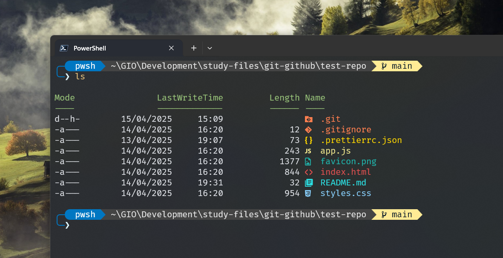

# Main Setup

### 1️⃣ Windows Terminal

- Add `-NoLogo` to the path in the PowerShell *Command Line* option.

### 2️⃣ PowerShell

### 3️⃣ Nerd Fonts

- FiraCode.

### 4️⃣ Terminal Icons

- Remove the `<GroupBy>` tag from the `Terminal-Icons.format.ps1xml` file located in the Documents directory.
- Replace the `devblackops.psd1` file in the `colorThemes` directory.

### 5️⃣ Oh My Posh

### 6️⃣ z

- PowerShell version.